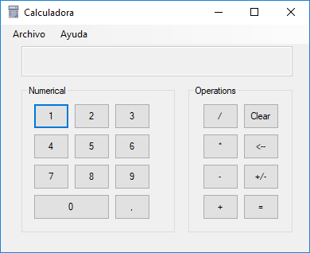
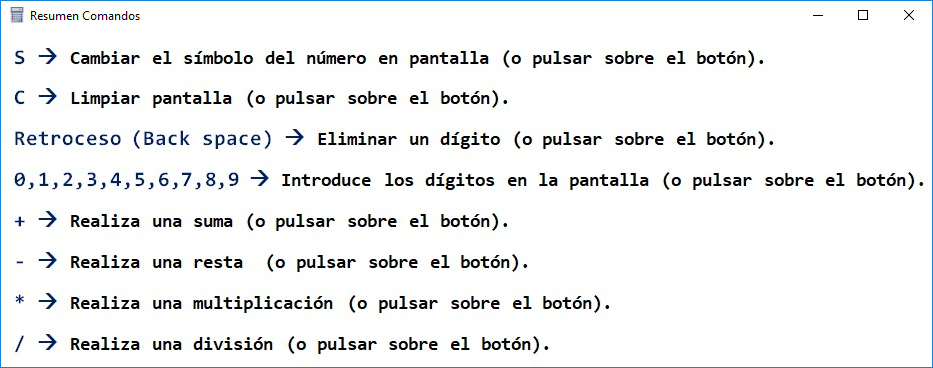
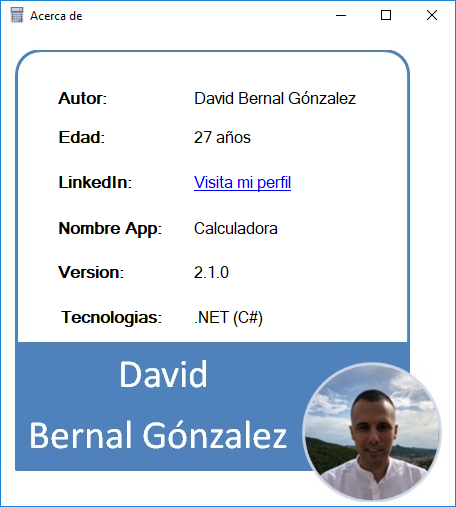

# Welcome to Calculator in C# with .NET!

Hi! I'm David Bernal Gonzalez and I make a **Calculator** project. This it's a project elaborated with:

**Language: C#**
**Framework: .NET**
**IDE: Visual Studio Code**

# Explain the project

## First folder
|File                |Do                          
|----------------|-------------------------------|
|Calculadora.sln|`'Contains the solution for open the project with the IDE.'`            
|Readme.md         |`"This file, it's the card to presentation of the project in GitHub. This file it's writing with Markdown."`            
|Folder CalculadoraII          |`Constains all the files that are loaded when calling the solution Calculadora.sln.`
The File Calculadora.sln it's the solution for open the project with the IDE.
The File Readme.md it's this file. And it's writing with Markdown.

## Second folder (CalculatorII>CalculatorII)

|File                |Do                            |Aditional info                     
|----------------|-------------------------------|-------------------------------
|Form1.cs|`'Calculator'`   |`'It's the first Form to load.'`         
|Form2.cs|`'Explain the Keyboard control.'`     | `'For open Form2 we must be click on Ayuda>Comandos Abreviados.'`    
|Form2.cs|`'Presentation of the autor.'`     | `'For open Form2 we must be click on Ayuda>Acerca de.'`  
# Looking at forms
## Form1 (Calculadora)
- Form1 (the first Form in load).
 
## Form2 (Resumen de comandos)

## Form3 (Acerca de)
 
# Run the aplication
For run the aplication we go to:
>CalculadoraII>Bin>Debug and run the file **Calculator.exe**

# Send the aplication
>For send the application we need make a zip or rar the file **Calculator.exe** and finally send the zip/rar package.

