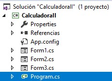

# Welcome to Calculator in C# with .NET!

Hi! I'm David Bernal Gonzalez and I make a **Calculator** project. This it's a project elaborated with:

**Language: C#**
**Framework: .NET**
**IDE: Visual Studio Code**
# Explain the project
The File Calculadora.sln it's the solution for open the project with the IDE.
The File Readme.md it's this file. And it's writing with Markdown.

The folder Calculadora constain the solution that we opened with the file Calculadora.sln

The project has the Main method in Program.cs. And, has three forms:
- Form1 (the first Form in load).
 
- Form2 (Ayuda>Comandos Abreviados)

- Form3 (Ayuda>Acerca de)
 

